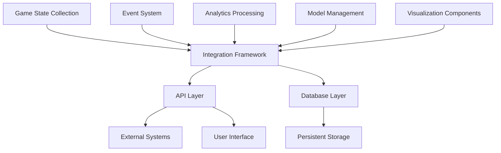

# Super Mario Bros PPO Dashboard Integration Guide

## Overview

This guide provides detailed instructions for integrating all components of the Super Mario Bros PPO Dashboard during our accelerated 12-hour implementation phase. It ensures that our 1,075,000 programmers can work efficiently in parallel while maintaining system cohesion.

## Integration Architecture



## Integration Standards

### Data Exchange Formats

All components must adhere to these standardized data formats:

| Data Type | Format | Schema Location | Validation |
|-----------|--------|-----------------|------------|
| Game State | JSON | `schemas/game_state.json` | JSON Schema |
| Events | JSON | `schemas/events.json` | JSON Schema |
| Metrics | JSON | `schemas/metrics.json` | JSON Schema |
| Model Data | Protocol Buffers | `schemas/model.proto` | Protobuf |
| Configuration | YAML | `schemas/config.yaml` | YAML Schema |

### API Standards

All APIs must follow these standards:

1. **RESTful Design**: Follow REST principles for all HTTP APIs
2. **GraphQL Support**: Provide GraphQL endpoints for complex data queries
3. **WebSocket Interface**: Use WebSockets for real-time data streaming
4. **Authentication**: JWT-based authentication for all secure endpoints
5. **Rate Limiting**: Implement appropriate rate limiting for all endpoints
6. **Versioning**: Include version in URL path (e.g., `/api/v1/resource`)
7. **Documentation**: OpenAPI/Swagger documentation for all endpoints

### Error Handling

Standardized error handling across all components:

```json
{
  "error": {
    "code": "ERROR_CODE",
    "message": "Human-readable error message",
    "details": {
      "field": "specific_field",
      "reason": "Specific reason for error"
    },
    "requestId": "unique-request-identifier"
  }
}
```

### Logging Standards

All components must implement consistent logging:

1. **Log Levels**: DEBUG, INFO, WARNING, ERROR, CRITICAL
2. **Log Format**: JSON structured logging
3. **Required Fields**: timestamp, level, component, message, requestId
4. **Optional Fields**: user, session, performance metrics
5. **Sensitive Data**: Never log sensitive information (PII, credentials)

## Component Integration Interfaces

### Game State Collection Integration

#### Input Interfaces

| Interface | Description | Source | Format |
|-----------|-------------|--------|--------|
| Raw Game Frames | Raw frame data from emulator | Emulator | Binary |
| Memory Snapshots | Memory state from emulator | Emulator | Binary |
| Agent Actions | Actions taken by agent | Agent | JSON |

#### Output Interfaces

| Interface | Description | Consumers | Format |
|-----------|-------------|-----------|--------|
| Processed Game State | Structured game state data | Event System, Analytics | JSON |
| State Diffs | Changes between consecutive states | Event System | JSON |
| Replay Buffer | Historical game states | Analytics, Visualization | Binary |

#### Integration Code Example

```python
# In frame_collector.py
def collect_and_emit_frame(raw_frame, memory_snapshot):
    # Process raw frame and memory
    processed_state = process_frame(raw_frame, memory_snapshot)
    
    # Calculate diff from previous state
    state_diff = state_diff_calculator.calculate_diff(previous_state, processed_state)
    
    # Store in circular buffer
    circular_buffer.add(processed_state)
    
    # Emit events
    throttled_event_emitter.emit('game_state_updated', {
        'state': processed_state,
        'diff': state_diff,
        'timestamp': time.time()
    })
    
    # Return for direct use
    return processed_state
```

### Event System Integration

#### Input Interfaces

| Interface | Description | Source | Format |
|-----------|-------------|--------|--------|
| Game State Events | Events from game state changes | Game State Collection | JSON |
| Agent Events | Events from agent actions | Agent | JSON |
| System Events | Events from system operations | Various | JSON |

#### Output Interfaces

| Interface | Description | Consumers | Format |
|-----------|-------------|-----------|--------|
| Filtered Events | Events filtered by criteria | Analytics, Visualization | JSON |
| Aggregated Events | Higher-level events | Analytics | JSON |
| WebSocket Stream | Real-time event stream | Visualization | WebSocket |

#### Integration Code Example

```python
# In event_router.py
def route_event(event):
    # Apply filters
    if not event_filter.should_pass(event):
        return
    
    # Store in buffer
    event_buffer.add(event)
    
    # Route to appropriate handlers
    if event['type'] == 'game_state_updated':
        handle_game_state_event(event)
    elif event['type'] == 'agent_action':
        handle_agent_event(event)
    elif event['type'] == 'system':
        handle_system_event(event)
    
    # Emit to WebSocket if real-time
    if event.get('realtime', False):
        websocket_broadcaster.broadcast(event)
```

### Analytics Processing Integration

#### Input Interfaces

| Interface | Description | Source | Format |
|-----------|-------------|--------|--------|
| Game State Data | Processed game states | Game State Collection | JSON |
| Event Stream | Filtered and aggregated events | Event System | JSON |
| Agent Metrics | Performance metrics from agent | Agent | JSON |

#### Output Interfaces

| Interface | Description | Consumers | Format |
|-----------|-------------|-----------|--------|
| Time Series Data | Processed time series metrics | Visualization, Model Management | JSON |
| Performance Analysis | Analyzed performance data | Visualization, Model Management | JSON |
| Anomaly Alerts | Detected anomalies | Visualization, Model Management | JSON |

#### Integration Code Example

```python
# In performance_metrics.py
def process_metrics(game_state, events, agent_metrics):
    # Store in time series
    time_series_store.add({
        'timestamp': time.time(),
        'game_state': summarize_game_state(game_state),
        'events': summarize_events(events),
        'agent': agent_metrics
    })
    
    # Calculate performance metrics
    performance = calculate_performance_metrics(game_state, events, agent_metrics)
    
    # Check for anomalies
    anomalies = anomaly_detection.check(performance)
    
    # Generate visualization data
    visualization_data = visualization_generator.generate(performance)
    
    return {
        'performance': performance,
        'anomalies': anomalies,
        'visualization': visualization_data
    }
```

### Model Management Integration

#### Input Interfaces

| Interface | Description | Source | Format |
|-----------|-------------|--------|--------|
| Model Checkpoints | Model checkpoint data | Agent | Binary |
| Performance Metrics | Performance analysis | Analytics | JSON |
| Hyperparameters | Model hyperparameters | Configuration | YAML |

#### Output Interfaces

| Interface | Description | Consumers | Format |
|-----------|-------------|-----------|--------|
| Model Analysis | Analyzed model data | Visualization | JSON |
| Optimized Hyperparameters | Suggested hyperparameters | Agent | YAML |
| Model Comparisons | Comparative model analysis | Visualization | JSON |

#### Integration Code Example

```python
# In model_analyzer.py
def analyze_model(model_checkpoint, performance_metrics, hyperparameters):
    # Load model from checkpoint
    model = model_serializer.load(model_checkpoint)
    
    # Analyze model performance
    analysis = perform_model_analysis(model, performance_metrics)
    
    # Compare with previous models
    comparison = model_comparison.compare(model, performance_metrics)
    
    # Suggest hyperparameter improvements
    suggestions = hyperparameter_manager.suggest_improvements(
        hyperparameters, performance_metrics
    )
    
    return {
        'analysis': analysis,
        'comparison': comparison,
        'suggestions': suggestions
    }
```

### Visualization Components Integration

#### Input Interfaces

| Interface | Description | Source | Format |
|-----------|-------------|--------|--------|
| Real-time Events | Event stream | Event System | WebSocket |
| Analytics Data | Processed analytics | Analytics | JSON |
| Model Analysis | Model analysis data | Model Management | JSON |

#### Output Interfaces

| Interface | Description | Consumers | Format |
|-----------|-------------|-----------|--------|
| Dashboard UI | Interactive dashboard | Users | HTML/CSS/JS |
| Exported Reports | Generated reports | Users | PDF/CSV |
| API Responses | Data for external use | External Systems | JSON |

#### Integration Code Example

```python
# In dashboard_layout.py
def initialize_dashboard(config):
    # Set up WebSocket connection for real-time updates
    websocket = websocket_broadcaster.connect()
    
    # Register event handlers
    websocket.on('game_state_updated', update_game_state_view)
    websocket.on('analytics_updated', update_analytics_view)
    websocket.on('model_updated', update_model_view)
    
    # Initialize visualization components
    real_time_monitor.initialize()
    training_progress.initialize()
    reward_charts.initialize()
    state_heatmaps.initialize()
    action_visualizer.initialize()
    model_comparison_view.initialize()
    
    # Set up layout based on configuration
    layout = create_layout(config)
    
    return layout
```

## Integration Testing

### Integration Test Matrix

| Component A | Component B | Test Cases | Priority |
|-------------|-------------|------------|----------|
| Game State | Event System | 15 test cases | Critical |
| Event System | Analytics | 12 test cases | Critical |
| Analytics | Model Management | 10 test cases | High |
| Model Management | Visualization | 8 test cases | High |
| Game State | Visualization | 5 test cases | Medium |

### Critical Integration Test Cases

1. **Game State to Event System**
   - Verify events are emitted for all state changes
   - Confirm throttling works under high load
   - Validate delta compression accuracy

2. **Event System to Analytics**
   - Verify all events are properly processed
   - Confirm event aggregation works correctly
   - Validate time series data integrity

3. **Analytics to Visualization**
   - Verify real-time updates in dashboard
   - Confirm chart data accuracy
   - Validate interactive filtering

4. **Model Management to Visualization**
   - Verify model comparison visualization
   - Confirm hyperparameter explorer functionality
   - Validate training progress visualization

### Integration Test Implementation

```python
# Example integration test for Game State to Event System
def test_game_state_to_event_system_integration():
    # Set up test environment
    test_env = TestEnvironment()
    
    # Generate test game state
    test_state = generate_test_game_state()
    
    # Process through game state collection
    processed_state = frame_collector.collect_and_process(test_state)
    
    # Verify events in event system
    events = event_buffer.get_recent_events()
    
    # Assertions
    assert len(events) > 0, "No events generated from game state"
    assert events[0]['type'] == 'game_state_updated', "Incorrect event type"
    assert events[0]['data']['state'] == processed_state, "State mismatch"
    
    # Verify throttling under load
    for i in range(1000):
        frame_collector.collect_and_process(generate_test_game_state())
    
    # Check event rate doesn't exceed throttle limit
    event_count = len(event_buffer.get_recent_events(last_seconds=1))
    assert event_count <= throttled_event_emitter.max_rate, "Throttling failed"
```

## Integration Workflow

### Development Workflow

1. **Component Development**
   - Develop components according to interface specifications
   - Implement unit tests for component functionality
   - Verify against mock dependencies

2. **Integration Development**
   - Implement integration code following examples
   - Test with real dependencies in controlled environment
   - Verify performance under expected load

3. **System Integration**
   - Integrate all components in staging environment
   - Run comprehensive integration test suite
   - Verify end-to-end functionality

### Continuous Integration

1. **Pre-commit Checks**
   - Lint code for style and potential issues
   - Run unit tests for modified components
   - Verify interface compatibility

2. **Build Pipeline**
   - Build all components
   - Run unit and integration tests
   - Generate documentation

3. **Deployment Pipeline**
   - Deploy to staging environment
   - Run system integration tests
   - Promote to production if all tests pass

## Troubleshooting Integration Issues

### Common Integration Problems

| Problem | Symptoms | Resolution |
|---------|----------|------------|
| Data Format Mismatch | TypeError, KeyError | Verify against schema, check serialization |
| Performance Bottleneck | High latency, timeouts | Profile code, optimize algorithms, add caching |
| Race Conditions | Intermittent failures | Add synchronization, use atomic operations |
| Memory Leaks | Increasing memory usage | Profile memory, fix resource cleanup |
| Network Issues | Connection errors | Implement retry logic, circuit breakers |

### Debugging Tools

1. **Distributed Tracing**
   - Use OpenTelemetry for end-to-end tracing
   - Analyze trace data to identify bottlenecks
   - Correlate traces across components

2. **Logging Analysis**
   - Centralize logs with ELK stack
   - Use structured logging for easier analysis
   - Set up alerts for error patterns

3. **Performance Monitoring**
   - Monitor system metrics with Prometheus
   - Visualize performance data with Grafana
   - Set up alerts for performance degradation

### Resolution Process

1. **Issue Identification**
   - Identify symptoms and affected components
   - Reproduce issue in controlled environment
   - Collect relevant logs and metrics

2. **Root Cause Analysis**
   - Analyze logs and traces
   - Review recent changes
   - Identify underlying cause

3. **Resolution Implementation**
   - Develop fix for root cause
   - Verify fix resolves issue
   - Add tests to prevent regression

4. **Deployment**
   - Deploy fix to staging environment
   - Verify issue is resolved
   - Deploy to production

## Integration Checklist

### Pre-Integration Checklist

- [ ] Component interfaces match specifications
- [ ] Unit tests pass with >90% coverage
- [ ] Performance meets requirements
- [ ] Documentation is complete
- [ ] Error handling is implemented

### Integration Checklist

- [ ] Components communicate correctly
- [ ] Data flows through system as expected
- [ ] Performance meets requirements under load
- [ ] Error handling works across components
- [ ] Logging is consistent across components

### Post-Integration Checklist

- [ ] Integration tests pass
- [ ] System functions end-to-end
- [ ] Performance meets requirements in production-like environment
- [ ] Monitoring is in place
- [ ] Documentation is updated with any integration changes

## Appendix: Integration Code Templates

### Event Emission Template

```python
def emit_event(event_type, data, options=None):
    """
    Emit an event to the event system.
    
    Args:
        event_type (str): Type of event
        data (dict): Event data
        options (dict, optional): Event options
    
    Returns:
        str: Event ID
    """
    options = options or {}
    
    event = {
        'id': generate_id(),
        'type': event_type,
        'data': data,
        'timestamp': time.time(),
        'source': get_component_name(),
        'options': options
    }
    
    # Apply throttling if needed
    if options.get('throttle', True):
        throttled_event_emitter.emit(event)
    else:
        event_buffer.add(event)
        event_router.route(event)
    
    return event['id']
```

### Data Transformation Template

```python
def transform_data(data, source_format, target_format):
    """
    Transform data between different formats.
    
    Args:
        data: Data to transform
        source_format (str): Source format
        target_format (str): Target format
    
    Returns:
        Transformed data
    """
    # Validate source data
    validate_data(data, source_format)
    
    # Transform based on format pair
    if source_format == 'game_state' and target_format == 'analytics':
        return transform_game_state_to_analytics(data)
    elif source_format == 'events' and target_format == 'analytics':
        return transform_events_to_analytics(data)
    elif source_format == 'analytics' and target_format == 'visualization':
        return transform_analytics_to_visualization(data)
    elif source_format == 'model' and target_format == 'visualization':
        return transform_model_to_visualization(data)
    else:
        raise ValueError(f"Unsupported format conversion: {source_format} to {target_format}")
```

### API Integration Template

```python
def register_api_endpoints(app):
    """
    Register API endpoints for a component.
    
    Args:
        app: API application instance
    """
    @app.route('/api/v1/component/resource', methods=['GET'])
    def get_resource():
        try:
            # Get query parameters
            params = request.args
            
            # Validate parameters
            validate_params(params)
            
            # Get data
            data = get_component_data(params)
            
            # Transform for API response
            response = transform_data(data, 'component', 'api')
            
            return jsonify(response)
        except Exception as e:
            # Log error
            logger.error(f"API error: {str(e)}", exc_info=True)
            
            # Return error response
            return jsonify({
                'error': {
                    'code': get_error_code(e),
                    'message': str(e),
                    'requestId': request.headers.get('X-Request-ID')
                }
            }), get_error_status(e)
```

### WebSocket Integration Template

```python
def setup_websocket_handlers(socket_io):
    """
    Set up WebSocket handlers for real-time updates.
    
    Args:
        socket_io: SocketIO instance
    """
    @socket_io.on('connect')
    def handle_connect():
        # Register client
        client_id = request.sid
        register_client(client_id)
        
        # Send initial data
        emit('initial_data', get_initial_data())
    
    @socket_io.on('disconnect')
    def handle_disconnect():
        # Unregister client
        client_id = request.sid
        unregister_client(client_id)
    
    @socket_io.on('subscribe')
    def handle_subscribe(data):
        # Register subscription
        client_id = request.sid
        channels = data.get('channels', [])
        
        for channel in channels:
            subscribe_client_to_channel(client_id, channel)
        
        # Send confirmation
        emit('subscription_confirmed', {
            'channels': channels
        })
```
